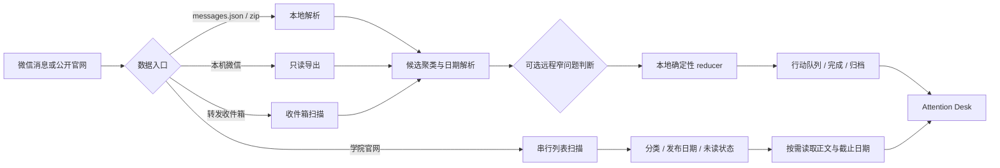

# 温州大学通知工作台


[](LICENSE)
[](https://github.com/sssssjw11/wzu-notice-scraper/stargazers)
[](https://github.com/sssssjw11/wzu-notice-scraper/commits/main)

温州大学通知公告的抓取、归档与行动分拣工具。

这个仓库包含两条可以单独使用的产品线：

1. **官网抓取器**：从温州大学官网页脚发现学院、部门和其他二级单位站点，串行抓取公开通知，按需下载正文、图片和附件，生成可离线浏览的图文库。
2. **Attention Desk 工作台**：把微信群导出的聊天记录、微信转发收件箱、本机微信或 `messages.json` 整理成按截止状态和优先级排序的行动队列，同时监测温州大学学院官网的公开公告。

项目的默认取向是：**少操作、易读、可追溯、尊重来源站点**。所有抓取请求串行执行；需要认证的页面会被记录并跳过；远程模型只负责窄问题的结构化辅助判断，最终优先级由本地规则确定。

> 当前交付形态是桌面端本地 Web 应用，仓库暂未提供独立的 Windows `.exe` 安装包。数据默认保存在本机；项目不含公共云端部署，也不会自动上传私人聊天记录。

## 目录

- [功能概览](#功能概览)
- [工作原理](#工作原理)
- [快速开始](#快速开始)
- [Attention Desk 部署](#attention-desk-部署)
- [Attention Desk 使用](#attention-desk-使用)
- [官网通知抓取流程](#官网通知抓取流程)
- [数据与隐私](#数据与隐私)
- [目录结构](#目录结构)
- [测试与质量检查](#测试与质量检查)
- [常见问题](#常见问题)
- [贡献与许可](#贡献与许可)

## 功能概览

### Attention Desk

- 微信 `messages.json` 导入。
- 微信「导出聊天记录」zip 本地解析，支持正文、图片、文件等附件清单。
- 转发收件箱：把聊天记录转发给 WorkBuddy，工作台自动发现并导入。
- 本机微信只读入口：发现已安装的导出器，或读取已有本地解密 SQLite。
- 消息日期范围筛选，分析基准日独立控制截止状态。
- 本地 Jev 基线、TypeSafe Jev、DeepSeek 和自定义 Jev API。
- P0–P3 优先级、待复核、已完成、超期归档和撤销完成。
- 截止日期动态状态：超期、今日截止、临近、宽裕、未排期。
- 温州大学 22 个学院公开来源监测。
- 公告分类：比赛 / 活动通知、公示、其他公告、待确认。
- 公告发布日期、按需读取的活动 / 报名截止日期、原文证据和失败原因。
- 未读、已读完、已完成三种状态独立保存。
- 学院来源拖动排序、右键置顶和本机持久化。
- DDL 邮件摘要预览，支持 HTML 和纯文本，两阶段确认后发送。

### 官网抓取器

- 从温州大学官网页脚提取二级单位站点清单。
- 串行抓取通知列表，保留站点状态和来源信息。
- 日期、栏目、标题、文章链接结构化落盘。
- 按日期范围下载正文图文与附件。
- 识别 CAS、验证码、失效附件和 PDF 正文等常见边界。
- 生成 CSV、JSON、HTML 报告和可离线浏览的图文库。
- 所有步骤支持断点续跑。

## 工作原理



微信群处理遵循 JEV 风格的类型化判断：共享状态保存消息和证据，独立问题节点只回答布尔、选项或分数问题；日期、截止状态和最终优先级由本地逻辑计算。低置信度、非法枚举和远程覆盖会被拒绝。

## 快速开始

### 环境要求

- Python 3.10 或更高版本（完整运行 Attention Desk；根目录抓取器本身可运行于 Python 3.9+）。
- Node.js 18 或更高版本，npm 9 或更高版本。
- Windows 推荐使用 PowerShell；Linux 和 macOS 可使用等价的 Python、npm 命令。
- 官网抓取需要网络能访问目标公开站点；部分学院站点只允许校园网或学校 VPN。

### 获取代码

```bash
git clone https://github.com/sssssjw11/wzu-notice-scraper.git
cd wzu-notice-scraper
```

### 安装 Python 依赖

根目录抓取器和 Attention Desk 使用两组依赖。建议在仓库根目录建立统一虚拟环境：

```bash
python -m venv .venv
```

Windows PowerShell：

```powershell
.\.venv\Scripts\Activate.ps1
python -m pip install -r requirements.txt
python -m pip install -r attention-desk/server/requirements.txt
```

Linux / macOS：

```bash
source .venv/bin/activate
python -m pip install -r requirements.txt
python -m pip install -r attention-desk/server/requirements.txt
```

如果 PowerShell 阻止脚本执行，可以只对当前窗口临时放行：

```powershell
Set-ExecutionPolicy -Scope Process Bypass
```

### 先启动工作台

Windows 最简单：

```powershell
cd attention-desk
.\start.ps1 -Install
```

`-Install` 会安装前端依赖、创建根目录 `.venv`（如果不存在）并安装后端依赖，然后启动：

- 前端开发服务：`http://127.0.0.1:5173`
- 后端 API：`http://127.0.0.1:8765`

首次启动可以直接使用仓库内的 `data/demo_messages.json` 演示数据。真实数据不会因为启动演示而被读取。

## Attention Desk 部署

### Windows 开发模式

```powershell
cd attention-desk
.\start.ps1 -Install
```

端口被占用时：

```powershell
.\start.ps1 -ApiPort 8865 -WebPort 5174
```

如果希望使用已经安装好的依赖，可以省略 `-Install`：

```powershell
.\start.ps1
```

### Linux / macOS 开发模式

在第一个终端启动 API：

```bash
cd attention-desk
../.venv/bin/python -m uvicorn server.main:app --host 127.0.0.1 --port 8765
```

在第二个终端启动 Vite：

```bash
cd attention-desk
ATTENTION_API_PORT=8765 npm run dev -- --host 127.0.0.1 --port 5173
```

然后打开 `http://127.0.0.1:5173`。

### 本地生产模式

生产模式将 React 构建产物交给 FastAPI 直接提供，适合在一台电脑上长期运行：

```powershell
cd attention-desk
npm ci
..\.venv\Scripts\python.exe -m pip install -r server\requirements.txt
npm run build
..\.venv\Scripts\python.exe -m uvicorn server.main:app --host 127.0.0.1 --port 8765
```

构建完成后打开 `http://127.0.0.1:8765`。FastAPI 会从 `attention-desk/dist/` 提供前端页面，并在同一个端口提供 `/api/*` 接口。

### 常用环境变量

| 变量 | 默认值 | 作用 |
|---|---:|---|
| `ATTENTION_API_PORT` | `8765` | Vite 开发代理指向的 API 端口 |
| `ATTENTION_WEB_PORT` | `5173` | Vite 开发服务端口 |
| `ATTENTION_SAMPLE_PATH` | `data/demo_messages.json` | 演示消息文件路径 |
| `ATTENTION_INBOX_POLL` | `10` | 转发收件箱轮询秒数；设为 `0` 关闭后台轮询 |

## Attention Desk 使用

### 1. 选择数据来源

设置面板中有四条互相独立的入口：

| 入口 | 输入 | 适用场景 |
|---|---|---|
| 导入文件 | `messages.json` | 已有导出器或其他工具生成的标准消息包 |
| 聊天记录包 | 微信导出的 `.zip` | 直接使用微信桌面端导出的聊天记录 |
| 本机微信 | 已安装导出器或本地解密数据库 | 只读读取指定群聊 |
| 转发收件箱 | WorkBuddy 接收的聊天记录压缩包 | 不想手动选择文件时使用 |

### 2. 分拣微信群通知

1. 打开设置，选择数据来源。
2. 选择群聊、上传 `messages.json` 或选择聊天记录 zip。
3. 设置消息日期范围。开始日期和结束日期都是闭区间，可以只填写一端。
4. 设置分析基准日。它只用于判断“临近、超期”等截止状态。
5. 选择判断提供方：
   - 本地 Jev 基线：不上传消息，适合默认使用。
   - TypeSafe Jev：填写 API key。
   - DeepSeek：填写 API key，可使用默认 Endpoint。
   - 自定义 Jev API：填写兼容 `state + questions` 的 Endpoint。
6. 点击开始分拣。
7. 在进行中查看 P0–P3、截止状态和待复核项；点击勾选可完成并归档。
8. 在已完成或超期归档中找回历史事项，必要时撤销完成。

日期和优先级的最终计算在本地完成。远程提供方只回答窄问题，不负责直接改写截止日或最终优先级。

### 3. 监测学院官网

1. 点击左侧地球图标进入“公开来源温州大学 · 学院官网”。
2. 首次使用点击“检查全部”，也可以选择指定学院。
3. 使用学院、日期、关键词、分类和“全部 / 未读 / 已读完”筛选。
4. 列表直接展示公告发布日期；打开详情后才按需读取正文。
5. 有可靠正文证据时展示活动 / 报名截止日期；无法确认时显示“未识别”。
6. 标记已读和标记完成是两个独立操作。
7. 学院列表支持拖动排序，右键菜单可以置顶或取消置顶。

官网监测只读取公开页面。认证墙、非温大域名跳转、空正文和请求失败都会展示具体原因。

### 4. 转发收件箱

将微信聊天记录导出为 zip 后转发给 WorkBuddy。工作台会在本地收件箱目录中发现稳定且通过 zip 校验的文件：

```text
data/attention-desk/inbox/
```

前端进入“转发收件箱”后选择条目并开始分拣。文件按内容哈希去重，原始文件只读保留，导入结果写入被 Git 忽略的本地目录。

### 5. 邮件摘要

右上角邮件摘要会根据当前进行中事项生成 HTML 或纯文本预览。收件人保存在浏览器本地，发送前会先展示主题和正文，再经过第二步确认。邮件只包含行动事项、截止日期和摘要，不包含完整聊天原文。

## 官网通知抓取流程

根目录脚本适合生成离线图文库，和 Attention Desk 的轻量官网监测是两种不同用途：

```text
extract_footer.py
        ↓
scrape.py
        ↓
report.py（可选）
        ↓
download.py
        ↓
finalize.py → postprocess.py → verify.py → pack.py
```

### 典型命令

```bash
# 1. 从温州大学首页页脚更新站点清单
python extract_footer.py

# 2. 先抓 5 个站点验证网络与解析
python scrape.py --limit 5

# 3. 全量串行抓取通知列表
python scrape.py

# 4. 生成列表总览报告
python report.py

# 5. 先下载近 30 天正文与附件
python download.py --days 30

# 6. 去重并甄别验证码 / 失效附件
python finalize.py

# 7. 本地化图片并生成离线索引
python postprocess.py

# 8. 交付前完整性检查并打包
python verify.py --days 30
python pack.py
```

### 指定日期和小范围试跑

```bash
python download.py --since 2026-08-22 --until 2026-09-22
python download.py --limit 8 --no-assets
python download.py --dry-run
python download.py --retry-failed
python download.py --only rsc
```

`scrape.py` 和 `download.py` 都支持断点续跑。已有站点结果和 manifest 会被复用；需要强制重新抓取时使用脚本帮助中提供的 `--force` 参数。

预览离线库：

```bash
cd download
python -m http.server 8765 --bind 127.0.0.1
```

然后打开 `http://127.0.0.1:8765/`。

### 日期、类别与状态口径

- **公告发布日期**来自学院列表页；它描述公告什么时候发布。
- **活动 / 报名截止日期**只在详情按需读取公开正文后提取；没有可靠原文证据时保持“未识别”。
- **消息日期范围**用于限定参与分拣的聊天消息；只填写开始或结束日期时仍按闭区间过滤。
- **分析基准日**用于计算事项今日截止、临近、宽裕或超期，和消息日期范围互不替代。
- 官网的**已读**、**已完成**、群聊事项的**超期归档**分别保存，不共享一个状态字段。

### 官网抓取器数据口径

抓取器按“站点 → 通知列表 → 单条正文和资源”分步运行。`scrape.py` 先建立列表目录，`download.py` 再依据列表中的日期范围处理正文和附件。这样可以先查看和筛选条目，再决定是否下载较大的图文资源。

博达系站点常见的列表日期隐藏在 `time<新闻ID>` 节点中；代码优先用新闻 ID 对应日期，避免把标题、页脚或版本号中的日期当发布日期。少数独立建设的站点不提供日期，记录会保留空日期。文章链接、栏目和正文模板存在差异，站点改版后解析结果可能需要维护。

附件文件名通常从响应头读取。如果服务器返回验证码或中间页，落盘文件可能是 `.jsp` 页面而非真正附件；`finalize.py` 和 `verify.py` 会帮助发现这类情况。需要认证的页面会记录并跳过，不会尝试绕过访问控制。

### 根目录脚本索引

| 脚本 | 作用 | 主要产出 |
|---|---|---|
| `extract_footer.py` | 从温州大学首页页脚发现学院、部门和其他单位站点 | `sites.json`（运行时） |
| `scrape.py` | 串行抓取通知栏目和文章条目 | `out/notices.csv`、`out/site_*.json` |
| `scrape_extra.py` | 为特殊站点补抓自定义栏目 | 覆盖对应 `out/site_*.json` |
| `report.py` | 生成通知列表总览 HTML | `out/温大各部门通知汇总.html` |
| `download.py` | 下载正文、图片和附件 | `download/<单位>/<通知>/` |
| `finalize.py` | 去重、核对 manifest、甄别验证码和失效附件 | 更新 `meta.json` 和 manifest |
| `postprocess.py` | 将远程图片本地化并生成离线索引 | `download/索引.html` |
| `verify.py` | 从 manifest 和磁盘两条路径核对完整性 | `out/verify_report.txt` |
| `pack.py` | 将离线图文库打包成 zip | `温州大学通知图文库_*.zip` |
| `probe_sites.py` | 探测各站点在当前网络下的可达性 | `out/site_reach.json` |
| `build_reach_list.py` | 将可达性结果整理成清单 | `out/外网可访问站点清单.md`、`.csv` |

每个脚本都支持 `-h` / `--help`。先用 `scrape.py --limit 5` 和 `download.py --limit 8` 做小范围验证，再决定是否运行全量任务。

### 抓取策略与站点边界

官网抓取器遵循三条固定规则：

1. **串行请求**：任何时刻只有一个请求在执行；页面和资源之间带随机延时。
2. **模拟正常浏览器访问**：使用浏览器请求头、Cookie 会话和文章页 Referer。
3. **遇到认证就停止深入**：CAS、验证码和需要登录的页面会记录状态并跳过，不尝试绕过。

单站点默认只检查一个首页和有限数量的通知列表页。这样速度会比并发爬虫慢，但能降低对学院站点的压力，也方便中断后继续。

站点群主要使用博达系 CMS，解析器重点适配以下结构：

- 页脚按学院、部门、其他单位分组。
- 通知栏目标题可能是没有链接的纯文本节点。
- 列表页常把日期放在 `time<新闻ID>` 隐藏节点中。
- 文章正文常见于 `#vsb_content` 或 `.v_news_content`。
- 附件文件名从 `Content-Disposition` 响应头读取。

### 断点续跑与时间范围

抓取和下载状态逐条落盘，程序中断后可以重复运行同一命令：

- `out/site_<域名>.json`：站点抓取结果，已完成站点默认跳过。
- `download/_manifest.jsonl`：每条通知一行的下载状态和资源清单。
- `--retry-failed`：只重试上次失败或跳过的项目。
- `--prune`：把范围外目录移动到 `download/_范围外/`，只移动不删除。

下载和核对支持三种时间范围：

```bash
python download.py --days 30
python download.py --since 2026-08-22 --until 2026-09-22
python download.py
```

两端日期都是闭区间；不传参数表示处理已有列表中的全部条目。没有日期的上游条目会保留在结果中，但不会被日期范围筛选误收。

### 主要产物

```text
out/
├── notices.csv                 # 通知条目汇总
├── site_<域名>.json             # 单站点断点文件
├── 温大各部门通知汇总.html       # 可搜索、筛选的列表报告
└── verify_report.txt           # 完整性核对报告

download/
├── 索引.html                    # 离线浏览入口
├── _manifest.jsonl             # 下载记录
└── <单位>/<日期>__<编号>__<标题>/
    ├── meta.json
    ├── 内容.md
    ├── 正文.html
    ├── 图片/
    └── 附件/
```

`out/` 和 `download/` 是本地生成产物，不提交到 Git。`data/sites.json` 是随仓库分发的站点目录，clone 后可以直接运行 `scrape.py`；需要更新目录时再执行 `extract_footer.py`。

## 数据与隐私

- 微信数据默认只在本机解析和保存。
- 只有用户主动选择远程提供方时，候选消息片段和可选用户画像才会发送到填写的 API。
- API key 只在当前请求中使用，不写入仓库文件。
- `data/attention-desk/`、`data/contacts/`、`vendor/`、`reports/`、`out/`、`download/` 等运行时目录已加入 `.gitignore`。
- `data/demo_messages.json` 是合成演示数据，不是私人聊天记录。
- 官网监测只访问公开温州大学域名，不绕过认证，不下载详情页图片和附件。
- 如果将日志、报告或截图分享给他人，应先确认其中没有联系人、聊天原文、令牌或本地路径。

## 目录结构

```text
.
├── attention-desk/                 # React + FastAPI 本地工作台
│   ├── src/                        # 前端界面
│   ├── server/                     # API、解析器、官网监测、导入桥
│   ├── public/                     # 图标等静态资源
│   ├── start.ps1                   # Windows 一键启动脚本
│   ├── package.json                # 前端依赖与构建命令
│   └── README.md                   # 工作台详细手册
├── .agents/skills/                 # 公告分拣技能与 JEV 规则
├── data/sites.json                 # 版本化的学院 / 部门站点目录
├── data/demo_messages.json         # 合成演示消息
├── scripts/                        # 导出器检查与辅助脚本
├── extract_footer.py               # 发现站点
├── scrape.py                       # 抓取通知列表
├── download.py                     # 下载正文、图片和附件
├── finalize.py                     # 甄别和去重
├── postprocess.py                  # 生成离线索引
├── verify.py                       # 完整性核对
├── pack.py                         # 交付打包
├── CREDITS.md                      # 合作与贡献记录
└── LICENSE
```

## 测试与质量检查

在仓库根目录运行：

```bash
python -m pytest attention-desk/server -q
python -m compileall attention-desk/server
git diff --check
```

构建前端：

```bash
cd attention-desk
npm ci
npm run build
```

验收重点包括：

- 微信文件、zip、本机微信和转发收件箱四条入口。
- 指定日期范围、分析基准日、完成归档和超期归档。
- 官网分类、发布日期、按需截止日期和已读完分区。
- API 提供方切换、低置信度回退和错误提示。
- 1280、1440、1920 宽度下的桌面布局。

## 常见问题

### `FeatureNotFound: Couldn't find a tree builder`

缺少 `lxml`，重新安装根目录依赖：

```bash
python -m pip install -r requirements.txt
```

### 页面打开但 API 请求失败

确认后端 API 已启动，并检查端口是否一致。开发模式下 Vite 默认把 `/api` 代理到 `8765`；如果修改了 API 端口，需要同时设置 `ATTENTION_API_PORT`。

### 端口被占用

Windows：

```powershell
.\start.ps1 -ApiPort 8865 -WebPort 5174
```

### 学院官网显示部分可用或需认证

这是来源站点的实际访问状态。部分学院站点只在校园网或 VPN 内可达，认证页面不会被绕过。重新检查或切换网络后可以再次扫描。

### 本机微信入口没有群聊

本机微信入口依赖已安装的导出器或已有兼容解密 SQLite。可以改用设置中的“聊天记录包”上传微信导出的 zip，或直接上传标准 `messages.json`。

### 为什么抓取很慢

官网抓取严格串行，并使用请求间隔、Referer 和断点续跑来降低对来源站点的压力。全量抓取和附件下载的耗时取决于站点数量、网络和资源大小。

### 为什么有些正文或附件没有下载

常见原因包括统一身份认证、单附件验证码、源站返回失效页面、PDF 以 iframe 形式嵌入，或当前网络无法访问该学院站点。程序会把这些情况写入结果和核对报告，不会把认证失败伪装成“没有公告”。

## 贡献与许可

欢迎提交 Issue、改进解析规则、补充站点兼容性测试或完善桌面体验。提交代码前请确认：

1. 不把真实聊天记录、API key、数据库、下载产物或本地运行状态加入 Git。
2. 不绕过认证、验证码或访问控制。
3. 抓取逻辑保持串行并尊重目标站点。
4. 修改 JEV 判断边界时补充回归样本和证据说明。

本仓库从 [x2y1eesss/wzu-notice-scraper](https://github.com/x2y1eesss/wzu-notice-scraper) 派生，合作与模块贡献见 [CREDITS.md](CREDITS.md)。

代码使用 [MIT License](LICENSE)。温州大学各二级单位网站上的通知、图片和附件版权归原发布方所有，使用离线归档时请遵守来源站点规则和适用法律。
